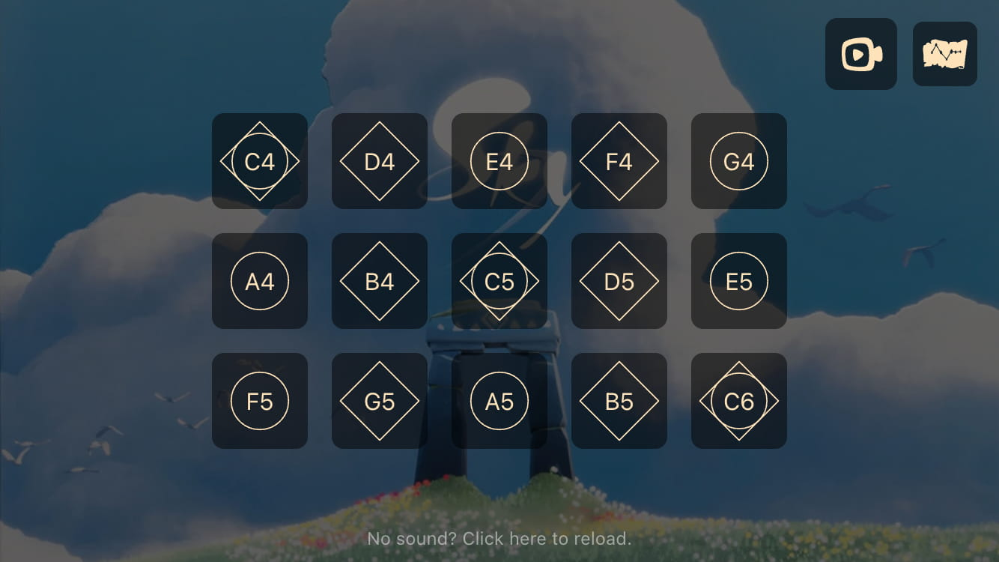

# Sky Piano Lite

🌐 语言: [中文](README.md) | [English](README.en.md)

**Sky Piano Lite** 是一款轻量级的网页版钢琴模拟器，灵感来自游戏 *Sky 光·遇*。  
你可以直接在浏览器中练习和演奏游戏中的乐器。



---

## ✨ 功能亮点

- **响应式设计**  
  无需安装，跨平台畅玩，在网页浏览器即可运行。

- **可视化反馈**  
  输入操作后有即时动画反馈，提升演奏手感。

- **可自定义背景**  
  可设置你喜欢的背景图片和颜色，打造专属风格。

- **音符标签显示切换**  
  可选是否显示琴键上的音符标签，适合新手和进阶玩家。

- **真实音效**  
  使用 Tone.js 库模拟真实乐器音色。

- **键盘支持**  
  使用电脑键盘快速演奏，更高效地练习。

- **乐谱录制与回放**  
  实时记录你的演奏，并自动导出乐谱文件；支持回放练习和分享旋律。

---

## ⚙️ 使用 `pref.json` 自定义配置

你可以通过修改项目根目录下的 `pref.json` 文件，调整行为和外观。

### 可配置项

- **背景设置**
  - `bgImage`: 背景图片路径。
  - `bgColor`: 背景遮罩颜色（HEX 格式，如 `#1a1a1a`）。

- **琴键标签**
  - `showNotes`: 是否显示琴键上的音符标签，`true` 显示，`false` 隐藏。

- **音符样本映射**
  - `samples`: 键盘按键与音符及音频文件的映射数组。

### 示例 `pref.json` 内容

```json
{
  "bgImage": "assets/background.jpg",
  "bgColor": "#1a1a1a",
  "showNotes": true,
  "instrument": "piano",
  "samples": [
    { "key": "a", "note": "C4", "sample": "C4.mp3" },
    { "key": "s", "note": "D4", "sample": "D4.mp3" },
    { "key": "d", "note": "E4", "sample": "E4.mp3" }
    // 根据需要添加更多映射
  ]
}
```

> ✅ 确保路径正确，所引用的图片与音频文件已存在。

---

## 🎵 乐谱文件格式说明

你可以创建或编辑 JSON 格式的乐谱，用于自动演奏。结构示例如下：

```json
{
  "name": "示例乐曲",
  "sampler": "piano",
  "defaultBpm": 90,
  "sheet": [
    { "time": 0, "type": "key", "value": "C5" },
    { "time": "+0.5", "type": "key", "value": "D5" },
    { "time": "+0.5", "type": "key", "value": "E5" }
  ]
}
```

字段说明：

- `time`: 时间戳，支持绝对数值（节拍）或相对时间（如 `"+0.5"`）。
- `type`: 当前支持 `"key"`（弹奏音符）和 `"tempo"`（变更节奏）。
- `value`: 要弹奏的音符（如 `"C5"`）或新的 BPM 值（用于节奏事件）。

---

## 🎮 控制方式

- **鼠标/触控**  
  点击或触摸屏幕上的琴键即可演奏。

- **键盘模式**  
  使用键盘映射的按键进行快速演奏。

- **录制功能**  
  开启录制模式可记录实时演奏，并保存为 JSON 乐谱文件。

---

## 🚀 本地运行

### 安装依赖并启动开发服务器：

```bash
pnpm install
pnpm dev
```

### 构建生产版本：

```bash
pnpm build
```

运行后点击界面上的录制按钮进行演奏录制，并使用保存按钮导出你的乐谱。

---

## 📄 License

本项目采用 [MIT License](LICENSE) 授权开源。